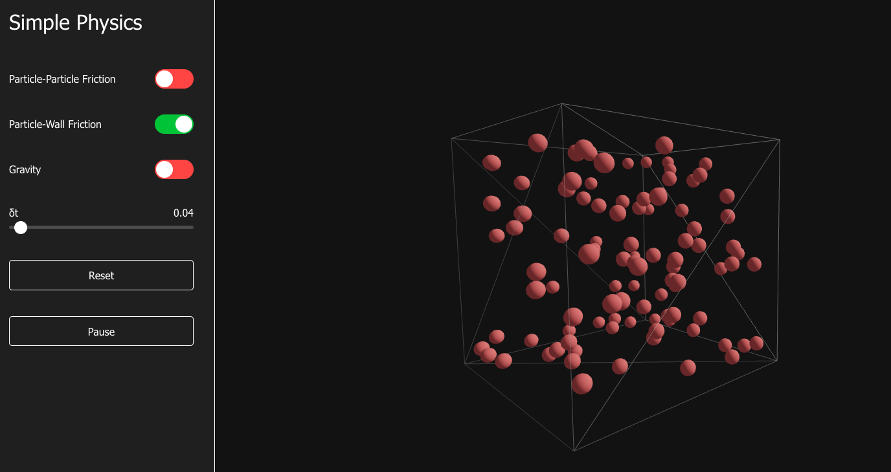

# SimplePhysics

A 3D particle physics simulator built with React, Three.js, and Rapier physics engine.


<!-- Note: You'll need to take a screenshot of your application and save it as public/screenshot.png -->

## Features

- Interactive 3D particle simulation with 100 particles
- Real-time physics with customizable parameters
- Toggle particle-to-particle friction
- Toggle particle-to-wall friction
- Toggle gravity simulation
- Adjustable delta time (simulation speed)
- Pause/resume functionality
- Reset simulation
- Orbit controls for camera movement

## Technologies Used

- React.js
- TypeScript
- Three.js / React Three Fiber
- Rapier 3D Physics Engine
- Vite

## Getting Started

### Prerequisites

- Node.js (v18 or higher)
- npm or yarn

### Installation

1. Clone the repository
   ```bash
   git clone https://github.com/yourusername/simplephysics.git
   cd simplephysics
   ```

2. Install dependencies
   ```bash
   npm install
   ```

3. Start the development server
   ```bash
   npm run dev
   ```

4. Open your browser and navigate to http://localhost:5173

## Building for Production

To build the application for production:

```bash
npm run build
```

To preview the production build:

```bash
npm run preview
```

## How It Works

The simulation creates a transparent 3D container with 100 particles that collide with each other and the container walls. The physics engine handles all collisions and interactions between particles.

### Controls

- **Particle-Particle Friction**: Toggle friction between particles
- **Particle-Wall Friction**: Toggle friction between particles and container walls
- **Gravity**: Toggle gravitational force
- **δt (Delta Time)**: Adjust simulation speed
- **Reset**: Restart the simulation with random particle positions
- **Play/Pause**: Control the simulation flow

### 3D Navigation

- **Rotate**: Click and drag to rotate the view
- **Zoom**: Scroll to zoom in/out
- **Pan**: Right-click and drag to pan

## License

This project is licensed under the MIT License - see the LICENSE file for details.

## Acknowledgements

- [Three.js](https://threejs.org/) for 3D rendering
- [React Three Fiber](https://github.com/pmndrs/react-three-fiber) for React integration with Three.js
- [Rapier](https://rapier.rs/) for the physics engine
